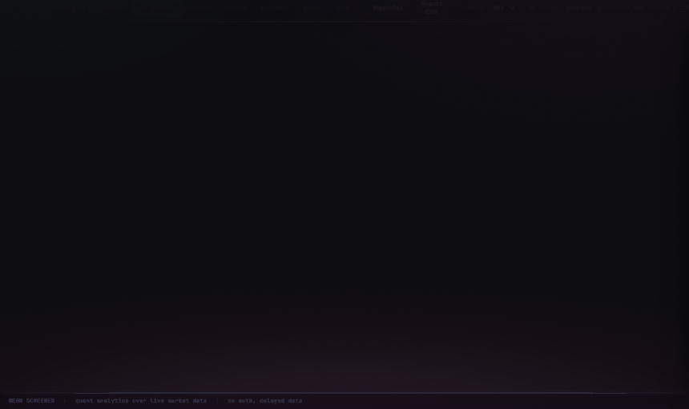
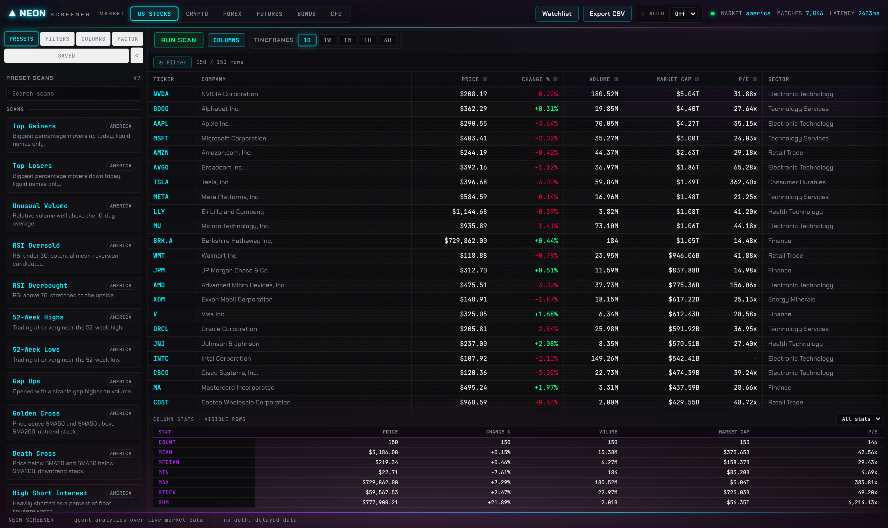
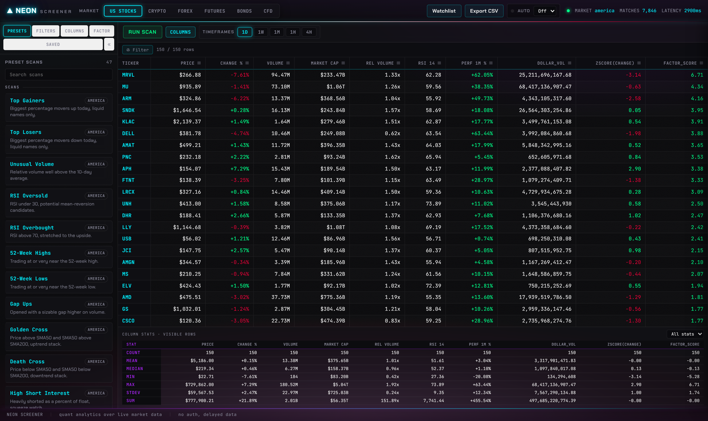
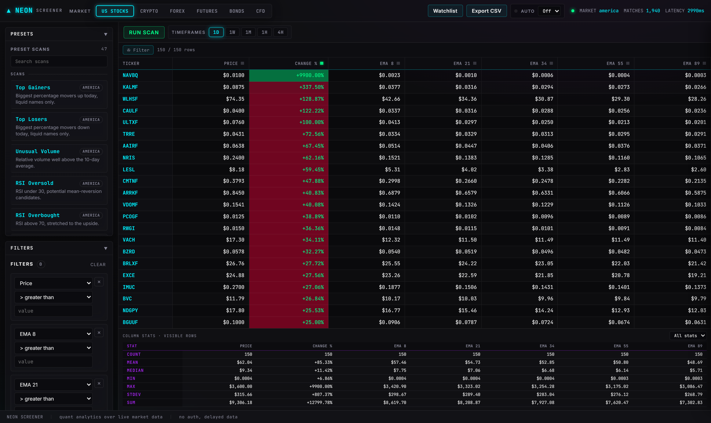

# SCANLINE

[](https://github.com/mphinance/screener/actions/workflows/ci.yml)
[](https://mphinance.github.io/screener/)
[](AGENTS.md)
[](LICENSE)

The most complete market screener of all time. A **quant analytics layer** on top of
TradingView's data, not a TradingView clone. Built in the synthwave / TraderDaddy /
Bloomberg-terminal aesthetic.

Powered by [`tradingview-screener`](https://github.com/shner-elmo/TradingView-Screener) for live,
no-auth delayed data across stocks, crypto, forex, futures, bonds, and CFDs. Filtering is table
stakes. The point of this build is everything you do to the data *after* it lands: computed
columns, factor scoring, in-result statistics, multi-key sort, client-side analytics.

Drive it from the browser, from the HTTP API, or from an AI agent: the same engine is exposed
over the **Model Context Protocol**, so Claude can screen, score, and rank markets for you in
plain language. See [MCP server](#mcp-server-screen-from-an-agent) below.

The repo is two halves. The **app** (`backend/` + `frontend/`) is the full screener you run at
home. The **showcase** (`showcase/`) is a static, pure-TradingView demo, a widget gallery plus a
live Lightweight Charts panel, that deploys to GitHub Pages:
**[mphinance.github.io/screener](https://mphinance.github.io/screener/)**.



*Every load powers on like an 80s mainframe.*



Hit `\` for full-table mode: the rail folds away and the factor-ranked table takes the whole screen.


## What makes it more than a clone

- **Computed columns.** Define your own derived fields with a safe expression engine, e.g.
  `(high-low)/close*100`, `close/sma50`, `volume*close`. Evaluated server-side with a sandboxed
  AST walker, no `eval`, no attribute access, no escapes.
- **In-result statistics.** Drop `zscore(field)`, `pctrank(field)`, `rank(field)`, or `norm(field)`
  columns that compute across the returned set, not the whole universe.
- **Composite factor scoring.** Assign weights and a direction (high or low is better) to any set
  of fields. The backend builds a direction-aware weighted z-score blend, returns a `factor_score`
  column, and ranks by it. Ships with Momentum, Value, Quality, Growth, and Low-Vol presets.
- **Multi-key sort.** Click to sort, shift-click to add secondary and tertiary keys with priority
  badges. Stable and numeric-aware, client-side.
- **Client-side filtering.** Per-column contains-filters and numeric min/max ranges that narrow the
  result instantly, no round-trip.
- **Summary-stat footer.** Count, mean, median, min, max, stdev, and sum per numeric column,
  recomputed on the visible (filtered) set.
- **Conditional formatting.** Per-column heatmap gradient (neon pink low, green high) plus
  sign-coloring for change and performance fields.



*Computed `dollar_vol`, a `zscore(change)` stat column, and a `factor_score` ranking, all live.*

## Signals, timeframes, drag-and-drop



- **Signal presets.** Grouped one-click technical scans across SIGNALS, MOMENTUM, TREND, and
  MULTI-TIMEFRAME. Golden / Death Cross, Above / Below All MAs, Gap and Go, Volume Breakout, the
  **Stacked EMA Ribbon** on the real Fibonacci periods `close > EMA8 > EMA21 > EMA34 > EMA55 > EMA89`,
  plus MACD bull/bear cross, Stochastic and Stoch RSI crosses, RSI-reclaims-50, Awesome Oscillator
  zero cross, CCI reversal, VWAP reclaim, EMA 8/21 flip, ADX strong-trend, Parabolic SAR, Williams
  %R, and TradingView's own Strong Buy rating. No faked periods, every field is an actual scanner field.
- **Multi-timeframe signals.** The kind that only became possible once the field universe was
  confirmed: Triple Screen Bull / Bear (RSI aligned above or below 50 on daily, weekly, and monthly
  at once) and MACD aligned bullish on both daily and weekly.
- **Multi-timeframe columns.** Toggle 1D / 1W / 1M / 1H / 4H and any technical column gets its
  suffixed siblings added alongside, so you can read `RSI`, `RSI|1W`, and `RSI|1M` side by side.
  Fundamentals are never suffixed.
- **Drag-and-drop columns.** Reorder by dragging table headers or column-picker chips. A plain
  header click still sorts.

## The rest of the surface

- Visual filter builder with the full operator set: comparisons, `between`, `isin`, `crosses`,
  `above_pct`, `like`, and more, with AND / OR grouping.
- Multi-market switcher: US stocks, crypto, forex, futures, bonds, CFDs. A market switch is a fresh
  canvas.
- 47 one-click preset scans (top gainers, unusual volume, RSI extremes, 52-week highs, the signal
  pack above, dividend aristocrats, crypto movers, and more).
- Column picker over the full TradingView field universe: ~190 curated, friendly-labelled
  fields lead, and every other queryable field (1000+ in total, probed live so none of them
  error) is reachable by search. A Columns button by the table opens it.
- Row detail drawer with a performance sparkline. Saved screens and a watchlist (localStorage).
  CSV export. Auto-refresh. Command palette (Ctrl-K) and full keyboard navigation.

## Versus the TradingView web screener

Their web screener filters a single market into a flat table. This does that, then keeps going
with things their screener simply does not offer:

- **Math on the result, not just filters.** Define computed columns with a real expression engine
  (`(high-low)/close*100`, `close/sma50`, `volume*close`) and rank by them. The web screener has
  no formula columns.
- **Composite factor scoring.** Blend any set of fields into one direction-aware weighted z-score
  and sort the market by it. There is no factor model in the web tool.
- **In-result statistics.** `zscore`, `pctrank`, `rank`, and `norm` computed across the returned
  set, so you see where each row sits inside *your* screen, not the whole universe.
- **True multi-key sort.** Primary, secondary, and tertiary keys with priority badges, not one
  sort column.
- **One field universe, six markets, one switch.** Stocks, crypto, forex, futures, bonds, and CFDs
  from the same surface. The web screener makes you pick a context up front.
- **The full field catalog, searchable.** ~190 curated friendly-labelled fields lead and every
  other queryable field (1000+) is reachable, probed live so none of them error.
- **Yours to script.** An open HTTP API and an MCP server. You can wire it into an agent, a
  notebook, or a cron. Their screener is a closed web page.
- **No account, no login, no upsell.** Live delayed data with nothing to sign up for.

## MCP server (screen from an agent)

The same live screen engine is exposed over the [Model Context Protocol](https://modelcontextprotocol.io),
so an AI agent can drive it directly. Built on [`fastmcp`](https://github.com/jlowin/fastmcp), it
reuses the exact pipeline the web app uses, so a screen behaves identically no matter who runs it.

Screening tools: `screen` (the full engine: filters, computed columns, stats, factor scoring,
sort), `run_preset`, `run_factor_preset`, `search_fields`, `list_operators`, `list_presets`,
`list_factor_presets`, `list_markets`, `lookup_symbol`, and `server_stats`. Cross-field filters
work out of the box, so `{"field":"SMA50","op":"crosses_above","value":"SMA200"}` is a golden cross.

Symbol intelligence (TradingView, AI'ed): `analyze` reads a chart into structured, plain-language
technical analysis (trend, momentum, range, rating, signals) and is **multi-timeframe in a single
call**, RSI and MACD bias on the 1h, 4h, 1d, 1w, and 1m at once with an alignment verdict, so
nobody has to swap timeframes. Plus `technical_rating` (the TradingView gauge across timeframes),
`search_symbols`, `compare`, `chart` (live chart deep-link plus a ready-to-embed widget config),
and `sector_breakdown`. Everything stays pure TradingView, no outside data.

MCP prompts ship canned workflows (`momentum_breakouts`, `oversold_quality`, `rank_by_factor`,
`read_symbol`). The full field catalog, presets, and operator reference are exposed as MCP
resources.

```bash
python run_mcp.py              # stdio, for Claude Desktop / Claude Code
python run_mcp.py --http 8765  # streamable-http for remote / multi-client
```

Register it with Claude Desktop (`claude_desktop_config.json`), using absolute paths:

```json
{
  "mcpServers": {
    "scanline": {
      "command": "/abs/path/screener/.venv/bin/python",
      "args": ["/abs/path/screener/run_mcp.py"]
    }
  }
}
```

Then just ask: *"Screen US mega caps with RSI under 35, add a dollar-volume column, and rank them
by my Value factor."* No TradingView account needed; data is live and delayed.

## Stack

- **Backend:** FastAPI + uvicorn, a thin wrapper over `tradingview-screener` with an in-memory TTL
  cache and a sandboxed analytics engine. Screen pipeline factored into `backend/pipeline.py` and
  shared by the HTTP API and the MCP server.
- **MCP:** `fastmcp` server in `backend/mcp_server.py` exposing the screen engine as tools and the
  catalogs as resources. stdio or streamable-http.
- **Frontend:** Vanilla JS ES modules and hand-rolled synthwave CSS. No build step.

## Run it

```bash
pip install -r requirements.txt
python run.py
```

Then open http://127.0.0.1:8000/. Data is live and delayed, no account needed. For real-time data
pass TradingView cookies through to `get_scanner_data`.

## Layout

```
backend/      FastAPI app, screen pipeline, screener service, analytics, field catalog, presets, cache
              + mcp_server.py (the same engine over MCP)
frontend/     index.html, css/, js/ feature modules (filters, columns, presets, factor, table, ...)
docs/         screenshots + capture.py (headless Playwright screenshotter)
run.py        launches uvicorn on 127.0.0.1:8000
run_mcp.py    launches the MCP server (stdio, or --http PORT)
tests/        pytest: analytics math, MCP wiring, + live API smoke
```

## Tests

```bash
python -m pytest tests/ -q
```

## Docs

- [AGENTS.md](AGENTS.md) the canonical guide for agents and contributors (rules, layout, how to extend).
- [CLAUDE.md](CLAUDE.md) the quick entry point for Claude Code.
- [docs/ARCHITECTURE.md](docs/ARCHITECTURE.md) how a screen flows through the pipeline and analytics.
- [docs/MCP.md](docs/MCP.md) the full MCP tool, prompt, and resource reference.
- [CONTRIBUTING.md](CONTRIBUTING.md) setup, tests, and how to add a preset, field, tool, or module.

## Notes

- Read-only by design. No order execution, no money movement.
- `tradingview-screener` exposes 3000+ fields. The catalog curates 172 of the most useful ones,
  grouped and typed; computed columns reach anything you can express from them.

## Credits

Built on TradingView and the [`tradingview-screener`](https://pypi.org/project/tradingview-screener/)
library by shner-elmo ([source](https://github.com/shner-elmo/TradingView-Screener)). The MCP server
uses [`fastmcp`](https://github.com/jlowin/fastmcp); the showcase uses TradingView's
[widgets](https://www.tradingview.com/widget/) and
[Lightweight Charts](https://github.com/tradingview/lightweight-charts). Full thanks and links in
[ACKNOWLEDGMENTS.md](ACKNOWLEDGMENTS.md). Independent project, not affiliated with TradingView.
